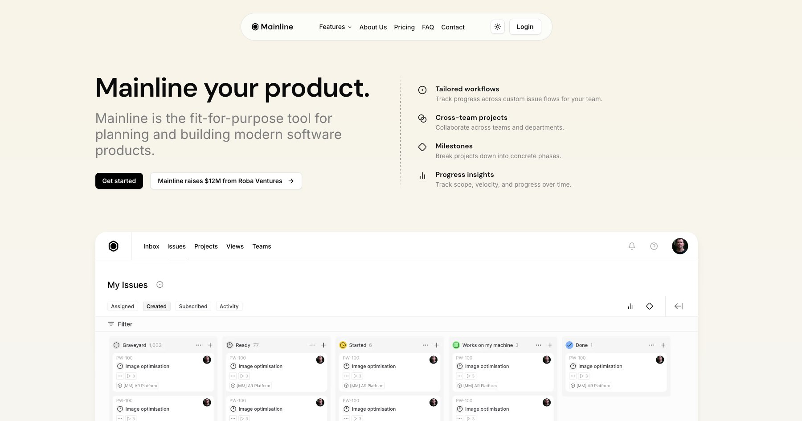

# Mainline SvelteKit Template

Mainline is a free, modern template built with [shadcn-svelte](https://github.com/shadcn-svelte/ui), Tailwind CSS 4, and SvelteKit.

---

- [Demo](https://mainline-svelte-template.vercel.app/)



---

## Getting Started

1. Install dependencies:
   ```sh
   pnpm install
   ```
2. Start the development server:
   ```sh
   pnpm dev
   ```
3. Visit [http://localhost:5173](http://localhost:5173) to view your app.

---

---

## Features

### Core Technology Stack

- **SvelteKit**: Fast, flexible, and modern web framework for building SSR, SSG, and SPA applications.
- **Tailwind CSS 4**: Utility-first CSS for rapid UI development.
- **shadcn-svelte**: Beautiful, accessible UI components for Svelte.
- **TypeScript**: Type-safe development out of the box.

### Key Features

- **Theme System**: Dark/light mode toggle, compatible with SvelteKit's best practices.
- **Form Handling**: Built-in validation and error handling using Svelte actions and Zod.
- **Animations**: Smooth transitions and interactive UI with Svelte's built-in animation features.
- **Pre-configured ESLint & Prettier**: Consistent code formatting and linting.
- **Custom Fonts**: DM Sans font family included.
- **Icons**: Lucide and other icon libraries supported.
- **Responsive Design**: Mobile-friendly layouts and components.
- **SEO Ready**: Meta tags, OG images, and accessibility best practices.
- **SvelteKit Routing**: File-based routing for pages and layouts.
- **Static & SSR Support**: Deploy as static site or server-rendered app.

### Pre-built Pages

- Home/Landing page
- About page
- Pricing page
- FAQ page
- Contact page with form
- Login/Signup pages
- Privacy Policy

### UI Blocks & Components

- Hero section
- Logo showcase & marquee
- Features section
- Resource allocation section
- Testimonials carousel
- Pricing table
- FAQ accordion
- Footer
- Navigation bar
- Theme toggle

## Deployment

Mainline SvelteKit Template is production-ready and can be deployed to platforms like [Vercel](https://vercel.com/), [Netlify](https://www.netlify.com/), or any hosting provider.

---

## Credits

This template is built and maintained with passion by:

### SikandarJODD
- GitHub: [SikandarJODD](https://github.com/SikandarJODD)
- Twitter/X: [@Sikandar_Bhide](https://x.com/Sikandar_Bhide)

I love building open source SvelteKit projects and sharing them with the community. If you find this template useful, please consider following me on Twitter/X and GitHub for updates, new releases, and more SvelteKit resources!

Feel free to reach out for feedback, suggestions, or collaboration.

---

---

## License

This project is licensed under the MIT License.

---

## About

Mainline SvelteKit Template is designed to help you build beautiful, performant web apps quickly using SvelteKit and shadcn-svelte. Built and maintained by **SikandarJODD**.
